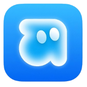

<p align="center">
  
</p>

<h1 align="center">CampusZen</h1>

<p align="center">
  A student-first social network. Discover students, follow people, post short updates, and interact — built for campus life in India.
</p>

<p align="center">
  <a href="https://github.com/user-synax/campus-zen"></a>
  
  
  
  
  <a href="LICENSE"></a>
</p>

<p align="center">
  <a href="#-quickstart">Quickstart</a> ·
  <a href="#-features">Features</a> ·
  <a href="#-api-reference">API</a> ·
  <a href="#-license">License</a> ·
  <a href="docs.md">Developer docs</a> ·
  <a href="PRD.md">PRD</a> ·
  <a href="DESIGN.md">Design</a>
</p>

---

## What is CampusZen?

CampusZen is an X-style social web app scoped to college students. One core loop, done well:

```
Sign up → Verify email (OTP) → Discover students → Follow → Post → Like / Reply / Repost → Get notified → Return
```

Intentionally small MVP: text-first posts (500 chars), chronological feeds, in-app notifications, block/report moderation. No DMs, no reels, no recommendation black box — see `PRD.md` for the full scope and explicit non-goals.

## ✨ Features

**Auth & accounts**

- Signup / login / logout, current-session (`/auth/me`), token refresh with rotation
- Email verification + password reset via 6-digit OTP (Gmail SMTP + Nodemailer, bcrypt-hashed, 10-min expiry, 5-attempt cap, 30s resend throttle)
- `gmail.com` / `proton.me` allowlist (enforced frontend + backend Zod)
- HTTP-only cookies (`SameSite=lax` / `none` + `Secure` in prod), `trust proxy` ready

**Profiles & social graph**

- Profile: avatar, cover, display name, username, bio, college, course/branch, year, accent, social links, pinned post, follower/following/post counts
- Follow / unfollow (duplicate-proof via partial unique indexes), followers/following lists, suggested students (`/me/suggestions`)
- Private accounts + follow requests (`/me/follow-requests/incoming|outgoing`, accept/decline), privacy settings (`PATCH /me/privacy`)
- Account lifecycle: data export (`GET /me/export`), deactivate/reactivate, delete
- Student directory (`/u`) with guest blur, public profiles (`/u/[username]`), college pages (`/c`, `/c/[slug]` with members + posts)
- Block / unblock (mutual hide + auto-unfollow both ways), report posts/users (instant local hide) + appeals (`POST /reports/appeals`)

**Posts & feed**

- Create / edit / delete own posts: 500 chars + multi-attachment media (images, GIFs, short video with posters, see `backend/src/models/Post.js:16-34`) or 2–4 option poll, Zod-validated, hashtags + mentions extracted automatically
- Like / unlike, reply threads, repost / unrepost, bookmark / unbookmark, poll votes (changeable, expiry-computed)
- Home feed with **Following** + **Discovery** tabs, cursor-paginated, `createdAt DESC`; public `/posts/public` for guests
- Single-post view (`/app/p/[id]`), bookmarks (`/app/bookmarks`), hashtags (`/app/tag/[tag]`), trending sidebar + suggestions rail
- Search users + posts (`/search?q=&type=`), college members/posts

**Notifications**

- In-app notifications for follows, likes, replies, reposts (+ follow-request events)
- Unread count, mark single / mark all read, clear-read + delete, pushed live over SSE (`GET /api/events`)
- Web Push (VAPID via `web-push`): public key, subscribe/unsubscribe (`/api/push/*`), OS-level delivery when app closed

**Admin (env-gated `ADMIN_EMAIL` + `ADMIN_PASSKEY`)**

- `/admin` page + `/api/admin/*`: stats, reports list/resolve, appeals review, delete post, suspend/unsuspend user

**Safety & hardening**

- `helmet`, `cors` (locked to `FRONTEND_URL`), `hpp`, `express-mongo-sanitize`, per-route rate limits, 10kb body cap
- Central `AppError` + `asyncHandler` error format: `{ success, message, code, details }`
- Fail-closed signup: if OTP email fails, the user record is rolled back

## 🧱 Tech stack

| Layer    | Choice |
| -------- | ------ |
| Frontend | Next.js 16 (App Router), React 19, JavaScript (JSX), Tailwind CSS v4, shadcn/ui, Framer Motion + Motion, lucide-react, date-fns, Biome |
| Backend  | Node.js (ESM), Express 4, Zod, Mongoose 8, JWT + bcryptjs, Multer (avatar/cover/post images), Nodemailer, Appwrite (server-side avatar/cover storage), SSE realtime |
| Database | MongoDB (Mongoose, text + compound indexes, TTL for OTPs) |
| Tooling  | Bun 1.4.2 (both workspaces, independent `package.json` files, no root workspace) |

Frontend and backend are separate apps. The browser talks to Next.js, Next.js talks to Express over `fetch` with `credentials: "include"`. The frontend never touches MongoDB directly.

```
Browser → Next.js (:3000) → Express API (:4000) → MongoDB
                              ↳ Appwrite (avatars) / Gmail SMTP (OTP)
```

## 📁 Monorepo layout

```
campus-zen/
├── README.md            # this file
├── LICENSE              # GNU AGPL-3.0
├── PRD.md               # product requirements (see file for scope and non-goals)
├── DESIGN.md            # design tokens & guidelines
├── docs.md              # full developer guide
│
├── frontend/            # Next.js app
│   ├── app/
│   │   ├── page.js              # landing (Hero, HowItWorks, Features, TrustSafety, Scope, FinalCTA)
│   │   ├── (auth)/              # login, signup, forgot/reset-password, verify-email
│   │   ├── app/                 # authenticated shell: feed, create (text+image+poll), search,
│   │   │                        #   notifications (SSE live), bookmarks, tag/[tag], menu, profile, p/[id]
│   │   ├── c/                   # colleges directory + [slug] (members, posts)
│   │   ├── u/                   # public: students directory + [username]
│   │   └── privacy/ terms/
│   ├── components/app/  # PostCard, PostComposer, LeftNav, BottomNav, ProfileHeader, ...
│   ├── components/auth/ # AuthShell, OtpInput, PasswordStrength
│   ├── components/landing/ # LandingNav, Hero, HeroVisual, Features, TrustSafety, Scope, FinalCTA
│   ├── components/ui/   # primitives: button, input, label, checkbox, tooltip, badge
│   └── lib/api.js       # central API client (single source of truth, auto-refresh)
│
└── backend/             # Express API
    └── src/
        ├── app.js / server.js
        ├── config/      # env, db, appwrite
        ├── routes/      # auth, users, posts, hashtags, search, notifications, reports, colleges, events (SSE)
        ├── controllers/ # thin, asyncHandler-wrapped
        ├── services/    # business logic lives here
        ├── middleware/  # auth, validate (Zod), rateLimiter, upload (Multer), errorHandler
        ├── models/      # User, Post, Comment, Like, Follow, Repost, Bookmark, PollVote, Notification, Block, Report, Otp, College
        └── utils/       # AppError, jwt, otp, email, cookies, hashtags, mentions, cache, college
```

> Full file map, architecture diagrams, and conventions: [`docs.md`](docs.md).

## 🚀 Quickstart

### Prerequisites

- Bun ≥ 1.4.2, Node.js LTS, MongoDB (local or Atlas), Appwrite account (avatars), Gmail SMTP (OTP emails)

```bash
git clone https://github.com/user-synax/campus-zen.git
cd campus-zen
```

### 1. Backend (`http://localhost:4000`)

```bash
cd backend
bun install
cp .env.example .env   # then fill in values below
bun run dev            # node --watch src/server.js
```

| Var | Example |
| --- | ------- |
| `MONGO_URI` | `mongodb://localhost:27017/campuszen` |
| `JWT_ACCESS_SECRET` / `JWT_REFRESH_SECRET` | 32+ random chars each |
| `FRONTEND_URL` | `http://localhost:3000` |
| `COOKIE_SECURE` | `false` locally, `true` in prod |
| `SMTP_HOST/PORT/USER/PASS` | Gmail SMTP + App Password |
| `EMAIL_FROM` | `noreply@campuszen.tech` |
| `APPWRITE_ENDPOINT/PROJECT_ID/API_KEY/BUCKET_ID` | avatar storage (server-side only) |
| `APPWRITE_BUCKET.COVER_ID` | cover image storage bucket |

### 2. Frontend (`http://localhost:3000`)

```bash
cd frontend
bun install
echo "NEXT_PUBLIC_API_URL=http://localhost:4000" > .env
bun run dev
```

| Script | What it does |
| ------ | ------------ |
| Frontend `bun run dev / build / start` | `next dev / build / start` |
| Frontend `bun run lint / format` | `biome check / biome format --write` |
| Backend `bun run dev / start / seed` | `node --watch src/server.js / node src/server.js / node src/utils/seed.js` |

Verify: `GET /health` and `GET /api/health` on `:4000` should return `{ success: true }`.

## 🔌 API reference

Base URL: `http://localhost:4000/api`. Success shape: `{ success: true, data }`. Error shape: `{ success: false, message, code, details }`. Full method list lives in `frontend/lib/api.js`.

| Method | Endpoint | Auth | Description |
| ------ | -------- | ---- | ----------- |
| `POST` | `/auth/signup` | – | Create account, send OTP |
| `POST` | `/auth/login` | – | Login, set HTTP-only cookies |
| `POST` | `/auth/logout` | Yes | Logout, clear cookies |
| `GET` | `/auth/me` | Yes | Current user |
| `POST` | `/auth/refresh` | Cookie | Rotate tokens |
| `POST` | `/auth/verify-email` | – | Verify OTP |
| `POST` | `/auth/resend-otp` | – | Resend OTP (30s throttle) |
| `POST` | `/auth/forgot-password` | – | Request reset OTP |
| `POST` | `/auth/reset-password` | – | Reset with OTP, revoke sessions |
| `GET` | `/users/:username` | Optional | Profile |
| `PATCH` | `/users/me` | Yes | Edit profile (also `PUT` alias) |
| `POST / DELETE` | `/users/:id/follow` | Yes | Follow / unfollow |
| `POST / DELETE` | `/users/:id/block` | Yes | Block / unblock |
| `POST` | `/users/me/avatar` | Yes | Avatar upload (multipart, 5MB, jpg/png/webp) |
| `POST` | `/users/me/cover` | Yes | Cover upload (multipart) |
| `POST / DELETE` | `/users/me/pin` | Yes | Pin / unpin post |
| `GET` | `/users/me/suggestions` | Yes | Suggested students |
| `GET` | `/users/me/follow-requests/incoming\|outgoing` | Yes | Private-account follow requests |
| `POST` | `/users/me/follow-requests/:id/accept\|decline` | Yes | Accept / decline request |
| `PATCH` | `/users/me/privacy` | Yes | Privacy settings (private account) |
| `GET` | `/users/me/export` | Yes | GDPR data export |
| `POST` | `/users/me/deactivate\|reactivate` | Yes | Deactivate / reactivate |
| `DELETE` | `/users/me` | Yes | Delete account |
| `GET` | `/users/me/bookmarks` | Yes | Bookmarked posts |
| `GET` | `/users/:username/posts|replies|likes|reposts|media` | Optional | Profile tab feeds |
| `POST` | `/posts/` | Yes | Create post (text + media[] image/gif/video or poll) |
| `GET` | `/posts/?author=&likedBy=&repostedBy=` | Optional | List posts by filter |
| `GET` | `/posts/feed?tab=` | Yes | Feed (`following` / `discovery`, paginated) |
| `GET` | `/posts/public` | – | Public feed for guests |
| `GET / PATCH / DELETE` | `/posts/:id` | Varies | Read / edit own / delete own |
| `POST / DELETE` | `/posts/:id/like` | Yes | Like / unlike |
| `POST / DELETE` | `/posts/:id/repost` | Yes | Repost / remove |
| `POST / DELETE` | `/posts/:id/bookmark` | Yes | Bookmark / remove |
| `POST` | `/posts/:id/vote` | Yes | Vote in poll |
| `POST / GET` | `/posts/:id/replies` | Varies | Reply / list replies |
| `GET` | `/search/?q=&type=` | Yes | Search users, posts, colleges (`all|users|posts|colleges`) |
| `GET` | `/hashtags/trending` | Yes | Trending hashtags |
| `GET` | `/hashtags/:tag/posts` | Optional | Posts by hashtag |
| `GET` | `/colleges/` | Optional | List/search colleges |
| `GET` | `/colleges/:slug` | Optional | College info |
| `GET` | `/colleges/:slug/members\|posts` | Optional | Members / college posts |
| `GET` | `/events` | Yes | SSE realtime (`notification`, `unread-count`, `post:update`, `follow:update`) |
| `GET` | `/push/public-key` | – | VAPID public key |
| `POST / DELETE` | `/push/subscribe\|unsubscribe` | Yes | Web Push subscribe / remove |
| `GET` | `/push/subscriptions` | Yes | List push subscriptions |
| `GET` | `/notifications/` | Yes | List (paginated) |
| `PATCH` | `/notifications/:id/read` | Yes | Mark one read |
| `PATCH` | `/notifications/read-all` | Yes | Mark all read |
| `DELETE` | `/notifications/clear-read` | Yes | Clear read |
| `DELETE` | `/notifications/:id` | Yes | Delete one |
| `GET` | `/notifications/unread-count` | Yes | Unread badge count |
| `POST` | `/reports/` | Yes | Report user or post |
| `GET` | `/reports/me`, `/reports/appeals/me` | Yes | My reports / appeals |
| `POST` | `/reports/appeals`, `/reports/:id/appeal` | Yes | File appeal |

Rate limits (see `backend/src/middleware/rateLimiter.js`): signup 5/hr, login 10/min, forgot/reset 5/hr, feed 60/min, general 100/min.

## 🎨 Design

X-style monochrome interface with exactly one chromatic accent. Tokens live in
`frontend/app/globals.css`; the spec is [`DESIGN.md`](DESIGN.md).

- **Palette** — canvas `#ffffff` · ink `#0f1419` · secondary `#536471` · tertiary `#829aab` · hairline `#cfd9de` / `#eff3f4` · hover `#eff3f4` · **accent `#1d9bf0`**
- **Single accent** — `#1d9bf0` appears only on things you can tap: follow/post buttons, links, verified badges, active nav, unread dots. Engagement states (like `#f91880`, repost `#00ba7c`, error `#f4212e`) are semantic, not decoration.
- **Type** — Inter (the documented TwitterChirp substitute) with `font-feature-settings: "ss01"`, 15px/20px body, 20px/23px headings, weights 400/500/700/800
- **Radii** — `16px` (cards, modals) and `9999px` (every button, tag, avatar); inputs `4px` per `DESIGN.md`
- **Layout** — 990px shell, three columns on desktop: `68px` collapsed icon rail (every item carries a tooltip) · feed · `290px` right rail; bottom tab bar on mobile
- **Surfaces** — white on white. Cards are never elevated; they are separated by 1px hairlines. Shadows are for dropdown overlays only.
- **Light + dark** — same token system inverted. The `cz-theme` cookie is read in the root layout and stamped on `<html>`, so the first paint is already correct — no flash, no client script. Toggle in the icon rail or under **Menu → Appearance**.

## 🗺️ Roadmap

- [x] **MVP** — auth + OTP, profiles (avatar/cover/pinned), follow, text+image+poll posts, feed (Following/Discovery), like/reply/repost/bookmark, hashtags + trending, colleges, search, notifications (in-app + SSE realtime), block/report, suggestions
- [x] **Shipped past MVP** — multi-media posts (image/gif/video, `Post.media`), mentions autocomplete + extraction, Web Push (`/api/push/*`), private accounts + follow requests, account export/deactivate/delete, admin dashboard (`/admin` + `/api/admin/*`), report appeals
- [ ] **V1** — improved feed ranking, student/college verification, expanded college pages, profile customization, better notifications
- [ ] **V2** — communities (college groups, roles, feeds, discovery)
- [ ] **V3** — realtime DMs, group chats, voice/video, clips, events

Out of MVP by design: DMs, stories, marketplace, premium, AI, mobile apps — see PRD §23.

## 🤝 Contributing

1. Fork + branch off `main` (`feat/<name>`, `fix/<name>`).
2. Keep frontend/backend deps separate; run `biome` before pushing frontend changes.
3. Backend: put logic in `services/`, keep controllers thin, validate with Zod, use `AppError` + `asyncHandler`.
4. Never commit `.env`; update `backend/.env.example` when adding vars.
5. Open a PR describing the user flow tested (signup → post → interact).
6. By submitting a contribution, you agree that it is licensed under the same [AGPL-3.0](LICENSE) license as the project.

## 📄 License

Copyright (C) 2026 Ayush.

CampusZen is free software licensed under the [GNU Affero General Public License v3.0](LICENSE). You may use, study, and modify the code. If you distribute a modified version, or run one as a network service, you must release your complete source code under the same license and preserve copyright and license notices (see section 13 of the license).

**Trademark.** The CampusZen name, logo, and branding are not covered by the AGPL license and may not be used without permission. Forks and derivative works must use their own name and branding.

## 📚 Docs

- [`docs.md`](docs.md) — complete developer guide (setup, architecture, schema, patterns, deployment)
- [`PRD.md`](PRD.md) — product requirements, MVP criteria, roadmap
- [`DESIGN.md`](DESIGN.md) — design tokens and component rules

---

<p align="center">Built for students, by students. If CampusZen helps your campus connect, star the repo.</p>
